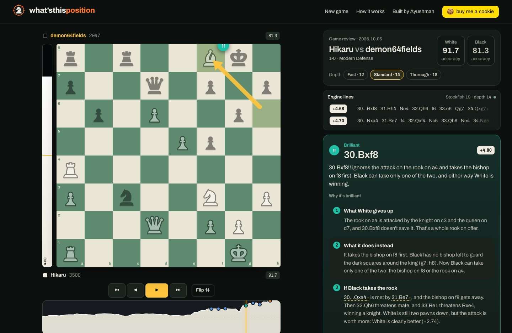
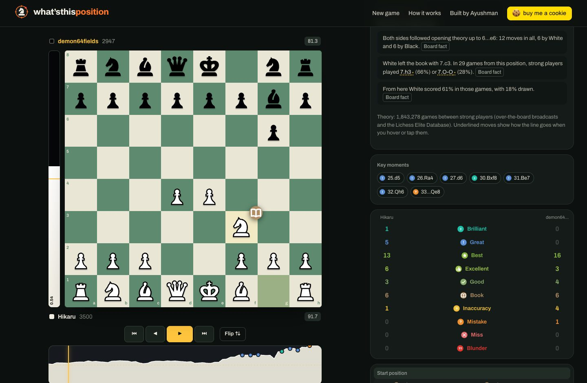
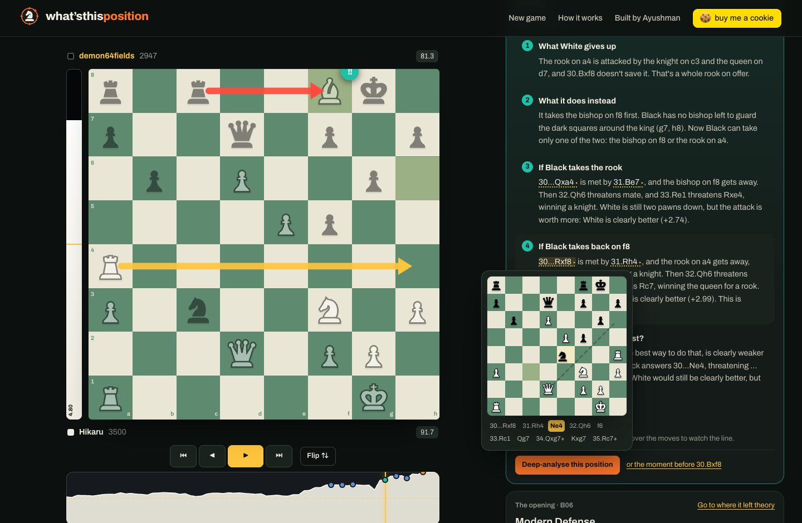
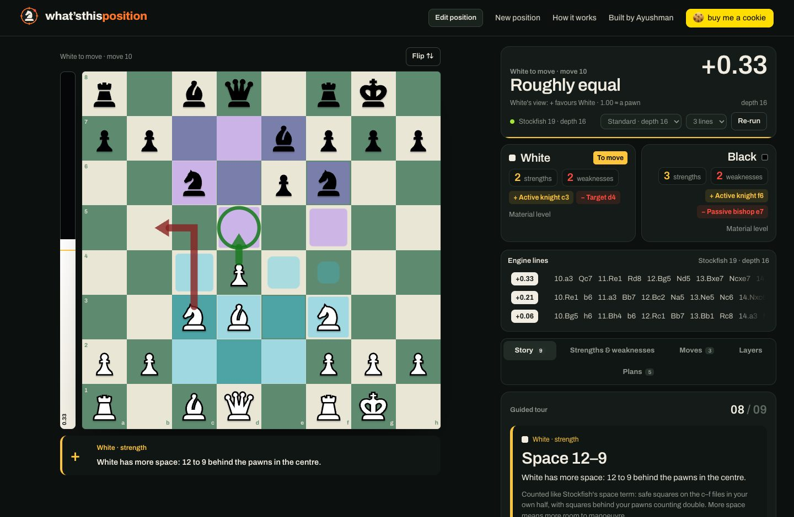
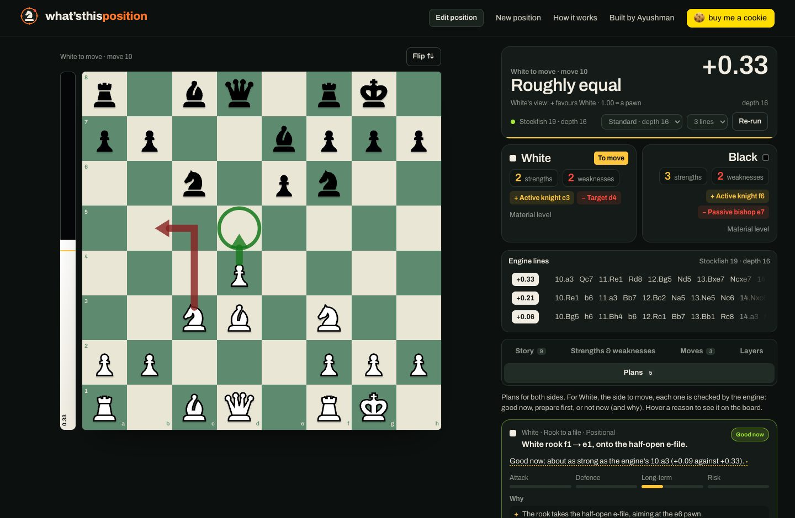

<div align="center">


# what’sthisposition

**Chess games and positions, explained so anyone gets *why*.**

Free and open source. Stockfish 19 runs in your browser; nothing is uploaded.

[**whatsthisposition.com**](https://whatsthisposition.com) · [How it works](docs/HOW-IT-WORKS.md) · [How it compares](docs/COMPARISON.md) · [Self-host it](docs/DEPLOY.md)

[](https://github.com/acunli/whatsthisposition/actions/workflows/ci.yml)
[](LICENSE)
-5e8a6f)




</div>

## Why it exists

Game reviews are good at saying *what* happened. Here is how two popular sites describe Hikaru's 30.Bxf8!! against demon64fields (October 2026):

> **Chess.com:** "Ignoring the threat on the rook, a difficult move to see!"
>
> **Chessigma:** "Clever choice: you leave a piece under threat and stay no worse."

And here is ours:

> **30.Bxf8!! ignores the attack on the rook on a4 and takes the bishop on f8 first. Black can take only one of the two, and either way White is winning.**
>
> 1. **What White gives up:** the rook on a4 is attacked by the knight on c3 and the queen on d7, and 30.Bxf8 doesn't save it.
> 2. **What it does instead:** it takes the bishop on f8 first. Black has no bishop left to guard the dark squares around the king. Now Black can take only one of the two.
> 3. **If Black takes the rook:** 30…Qxa4 is met by 31.Be7, and the bishop gets away. Then 32.Qh6 threatens mate.
> 4. **If Black takes back on f8:** 30…Rxf8 is met by 31.Rh4, and the rook gets away. Then 32.Qh6 threatens mate.
> 5. **Why not save the rook first?** 30.Rd4 is clearly weaker (+2.25 against +4.8): Black answers 30…Ne4, hitting the queen.
>
> Every move in that text can be hovered to watch it play out on a small board.

That is the idea of the whole site: labels you already know, plus reasons a club player can follow, built from the board and from targeted engine searches, never invented.

## What it does

<table>
<tr>
<td width="50%" valign="top">

### Game review
Bring a game by **Chess.com or Lichess username**, **Lichess link** or **PGN**, or straight from Chess.com with the [browser extension](extension/README.md). Every move gets a Chess.com-style label (Brilliant, Great, Best, Excellent, Good, Book, Inaccuracy, Mistake, Miss, Blunder, Forced) from published, documented rules, plus accuracy on Chess.com's scale (within about 3.5 points of Chess.com's own numbers on reviewed games).

</td>
<td width="50%" valign="top">

### Why it's brilliant
For every Brilliant move: what is given up, what the move does instead, **what happens after each way of taking it**, the best defence, and why the obvious move falls short. Checked on 213 brilliant moves from top players' games.

</td>
</tr>
<tr>
<td valign="top">



### Openings, as deep as theory goes
Book moves come from **1.84 million games between strong players**. Each one says how often strong players choose it and how they score; the opening card shows where the game left theory and what strong players play there.

</td>
<td valign="top">



### Every line can be watched
Hover or tap any move an explanation names (“31.Be7”, “the main line goes on 2…e6 3.Nc3”) and a small board plays the line out, move by move.

</td>
</tr>
<tr>
<td valign="top">



### A board you can think on
Top engine lines **next to the board**, live. **Play moves** by click or drag (the engine answers), and **draw arrows and circles** with right-click (Shift red, Alt blue), just like Lichess.

</td>
<td valign="top">



### Position X-ray and plans
Any position (FEN, hand setup or a **screenshot read on your device**): threats, weaknesses and strengths for both sides drawn on the squares, and plans with an engine verdict: good now, prepare first, or not now (and why).

</td>
</tr>
</table>

## On Chess.com: the browser extension

Finish a game on Chess.com and a card pops up in the corner: press **Analyze** and the game is reviewed on your computer, with both players' accuracy and how many moves of each kind they made. **See every move explained** opens the full review here. It only acts on finished games and collects nothing. Install it from [`extension/`](extension/README.md) (`npm run ext:build`, then "Load unpacked").

## How it compares

|  | what’sthisposition | Chess.com Game Review | Lichess analysis | Chessigma |
| --- | --- | --- | --- | --- |
| Price | Free, unlimited | Limited reviews on the free plan | Free | Free |
| Source | Open (GPL-3.0) | Closed | Open (AGPL-3.0) | Not published |
| Brilliant / Great / Miss labels | Yes, rules documented | Yes | No (inaccuracy / mistake / blunder) | Yes (its own names) |
| *Why* a move is good or bad, in words | Step by step, from engine probes | Short coach comments | No | One-line comments |
| Watch the lines an explanation names (hover) | Yes | No | n/a (no written explanations) | No |
| Where the engine runs | Your browser | Their servers | Their servers or your browser | Not documented |
| Engine strength | Stockfish 19 lite, depth 12–18 | Full Stockfish on servers | Full Stockfish (multi-threaded) | Not documented |

Compiled in October 2026 from each site's public pages and our own use; details, sources and where others are stronger: [**the full comparison**](docs/COMPARISON.md).

## Quick start

```bash
git clone https://github.com/acunli/whatsthisposition.git
cd whatsthisposition
npm install          # also copies the Stockfish WASM build into public/engine
npm run dev          # http://localhost:3000
```

No keys or accounts are needed: review, analysis and the photo reader all work out of the box. Optional settings are in [`.env.example`](.env.example).

```bash
npm test             # unit tests plus real Stockfish runs in Node
npm run lint && npm run typecheck && npm run build
npm run ext:build    # the Chess.com extension, in extension/dist
```

**Hosting your own copy:** import the repository on [Vercel](https://vercel.com/new) (the free plan is enough, and no settings are needed), or use the Docker image with the ready-made Compose + Caddy setup on any small server. Costs, limits and adding a domain: [docs/DEPLOY.md](docs/DEPLOY.md).

## How it works, in one paragraph

Everything heavy runs in the visitor's browser. Stockfish 19 (single-threaded WebAssembly) reviews a game on a small pool of workers, then re-searches the tactical moments deeper. Labels come from expected-score loss with Chess.com's published bands. Explanations come from rules over verified board facts plus targeted engine probes: a null-move search for threats, `searchmoves` to test each way of taking a sacrifice, the opponent's refutation, and the obvious alternative. A small CNN reads screenshots on the device. The server only serves files and proxies Chess.com and Lichess. **Details:** [docs/HOW-IT-WORKS.md](docs/HOW-IT-WORKS.md).

## Project layout

```
src/app/            pages, API routes (games proxy, optional photo reader, health), metadata
src/components/     the board (BoardStage, PlayBoard), review, analysis, setup, home, loading veil
src/lib/engine/     UCI client, browser workers, review pool
src/lib/review/     PGN, labels, accuracy, opening book, game explanations
src/lib/reason/     move reasoning, line stories, "why it's brilliant"
src/lib/facts/      board facts: threats, structure, king safety, plans, …
src/lib/vision/     on-device photo reader (and the optional cloud reader)
extension/          the Chess.com browser extension (built from src/lib with esbuild)
scripts/            engine copy, opening-book builders, evaluation and training tools
docs/               how it works, comparison, deployment, research notes
```

## Contributing

Issues and pull requests are welcome; see [CONTRIBUTING.md](CONTRIBUTING.md). Two rules matter most here: **every explanation must come from the board or the engine** (no invented reasons), and **rules are fixed in general terms**, checked on games you haven't read yet, never tailored to one position.

## Licences and credits

what’sthisposition is free software under the **GNU GPL v3 or later** ([LICENSE](LICENSE)), because it ships Stockfish to browsers.

- **Engine:** [Stockfish](https://stockfishchess.org) via [Stockfish.js](https://github.com/nmrugg/stockfish.js) (GPL-3.0).
- **Pieces:** the "mpchess" set by Maxime Chupin (GPL-3.0+).
- **Font:** Archivo (SIL OFL).
- **Opening names:** [lichess-org/chess-openings](https://github.com/lichess-org/chess-openings) (CC0).
- **Opening statistics:** built from the [Lichess broadcast database](https://database.lichess.org/#broadcasts) (CC BY-SA 4.0; the book file `public/data/masters-book.bin.gz` is shared under the same licence) and the [Lichess Elite Database](https://database.nikonoel.fr/) (from the CC0 Lichess database).
- **Libraries:** three.js and React Three Fiber (MIT), chess.js (BSD-2-Clause).
- **Ideas:** the Brilliant and Great checks were informed by [WintrChess](https://github.com/WintrCat/wintrchess) (GPL-3.0), and reimplemented independently.

Full list: [/credits](https://whatsthisposition.com/credits).

<div align="center">

Built by [Ayushman](https://ayushman.rocks) · [buy me a cookie 🍪](https://www.buymeacoffee.com/ayushmanc)

</div>
