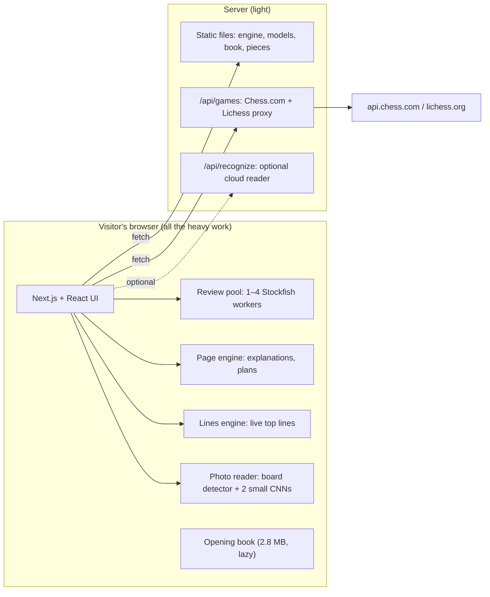

# How what’sthisposition works

This is the long version: what the site does, how each part works, the exact rules behind every label, how the explanations are built, and how we checked that they are any good. It is written for curious players and for contributors. For the comparison with other sites, see [COMPARISON.md](COMPARISON.md); for hosting, [DEPLOY.md](DEPLOY.md).

**Contents**

1. [The idea](#1-the-idea)
2. [Architecture at a glance](#2-architecture-at-a-glance)
3. [Game review](#3-game-review)
4. [How a move is explained](#4-how-a-move-is-explained)
5. [Why it's brilliant](#5-why-its-brilliant)
6. [Openings](#6-openings)
7. [Position analysis and plans](#7-position-analysis-and-plans)
8. [The board](#8-the-board)
9. [Reading a screenshot](#9-reading-a-screenshot)
10. [Speed and loading](#10-speed-and-loading)
11. [Privacy and security](#11-privacy-and-security)
12. [How we know it works](#12-how-we-know-it-works)
13. [Limitations](#13-limitations)

---

## 1. The idea

Most analysis tools tell you **what** the engine thinks: a number, a best move, a label. Club players then have to work out **why** themselves, from an engine line they can't picture.

what’sthisposition is built around the *why*:

- **Every reason is grounded.** It is a fact about the board ("the knight on c3 attacks the rook on a4"), or the result of a targeted engine search ("after 30…Qxa4 31.Be7, White threatens mate"). Nothing is written by a language model, and nothing is guessed from the evaluation alone.
- **Every line can be seen.** Moves named in an explanation are hoverable; a small board plays them out.
- **The rules are the same for every game.** Nothing is tuned to one position, and every label's rule is documented below and on the home page.

It is for intermediate players (roughly 800 to 1800) who want to understand their own games.

## 2. Architecture at a glance

- **Engine:** Stockfish 19, the "lite" single-threaded WebAssembly build (about 1.8 MB), runs in Web Workers. A game review uses a pool of up to four workers (one fewer than the CPU's cores). Explanations and plan checks use one more worker, and the live "engine lines" panel a third, so they never wait on each other.
- **Server:** Next.js serves the static files and two small API routes. `/api/games` exists because Chess.com and Lichess want a proper User-Agent and because some of their endpoints don't allow cross-origin requests from browsers. The optional `/api/recognize` reads angled photos of real boards with a vision model, when the host configures a key.
- **No database, no accounts.** Nothing a visitor imports is stored anywhere.

## 3. Game review

### 3.1 Import

A game can come from:
- a **Chess.com username** (the public PubAPI, last three monthly archives);
- a **Lichess username** or game link;
- a **pasted or dropped PGN**;
- a **link carrying the game** (`/#review=<PGN, base64url>&as=w|b&depth=18`), which is what the browser extension opens. The game is in the URL's fragment, which browsers never send to a server.

The PGN parser handles real-world files: comments, clock times (`[%clk]`), variations, NAGs, several games in one file, and games starting from a FEN. Every move is replayed with chess.js, and the first illegal move is reported by move number.

### 3.2 Two passes with the engine

1. **First pass.** Every position (the start, then after each move) goes to the worker pool in game order, with two lines per position (MultiPV 2), at the chosen depth: Fast 12, Standard 14, **Thorough 18** (the default). Each search starts with a fresh hash (`ucinewgame`), so the result doesn't depend on which worker happened to search what before: reviews are reproducible. Moves get their labels as soon as both sides of them are known.
2. **Verification pass.** Shallow searches misjudge exactly the moves that matter: sacrifices and blunders. Both sides of every Brilliant, Great, Mistake, Miss and Blunder, and of every near-best sacrifice, are searched again **four plies deeper**. (In the Immortal Game, depth 14 calls 19.e5 a blunder; depth 18 calls it an inaccuracy.) When a sacrifice's runner-up is a sacrifice too, one more search finds the best move that gives nothing away, so the sacrifice can be measured against playing it safe (§3.4).

### 3.3 The browser extension

The Chess.com extension (`extension/`) runs this same review on a finished Chess.com game, inside a card on the Chess.com page:

- **On request:** click the toolbar button on a Chess.com tab and it finds the game (from the URL; Chess.com's Game Review button, a link to `/analysis/game/live/{id}?tab=review`; the newest linked game; or the signed-in player's newest game) and opens a review card in the corner. Chess.com's game endpoint (`/callback/live/game/{id}`) says whether the game is over (`isFinished`), so a game in progress is never analysed.
- **The moves** come in Chess.com's compact TCN encoding (two characters a move, with promotions packed into the target square), decoded in `src/lib/review/chesscomGame.ts` and replayed with chess.js into a PGN.
- **The review** is the site's code, bundled with esbuild: the same labels, accuracy formula, opening book and default depth, with the verification pass. Stockfish runs in a hidden extension page (an offscreen document), not in the card: the card is embedded in Chess.com's page, where the browser may not let it start workers.
- **Handing over:** "See every move explained" opens the site with the game and the finished review in the link's fragment (`&data=…`: each position's depth, evaluation and lines, gzipped, about 4–8 KB). The site shows that review straight away instead of searching again; changing the depth on the site runs a fresh one. The card shows both accuracies and the label counts per player, then links to the full review on the site.

### 3.4 The labels

Each move is judged by how much of the mover's **expected score** it gives up compared with the engine's best move. Expected score comes from Lichess's win-probability curve, `1 / (1 + e^(−0.00368208 · centipawns))`; a forced mate counts as 1 or 0.

| Label | Rule |
| --- | --- |
| **Forced** | The only legal move. |
| **Book** | Opening theory, while the game is still in book: on a named opening line, or a move strong players really choose here (§6), and not one the engine calls a mistake. |
| **Best** | The engine's top move, or loses less than 0.005. A checkmating move is Best. |
| **Excellent** | Loses less than 0.02. |
| **Good** | Loses less than 0.05. |
| **Inaccuracy** | Loses less than 0.10. |
| **Mistake** | Loses less than 0.20. |
| **Blunder** | Loses 0.20 or more, or walks into a forced mate. |
| **Great** | The top move when the second-best move loses at least 0.10: the only good move. Not a free capture, and not a mate the mover already had. |
| **Brilliant** | The top move, a **real sacrifice**, and **better than playing it safe**: at least 0.01 better than the best move that gives nothing away (about the engine's noise, so a liquidation a quiet move matches doesn't count). When the second-best move is a sacrifice too, that quiet move gets a search of its own. |
| **Miss** | A Mistake or Blunder right after the opponent's Mistake, Blunder or Miss, that doesn't leave the mover worse off than before the opponent's error: the chance was let go. |

The bands follow Chess.com's published expected-points model; Great and Brilliant are only considered when the mover isn't already completely winning without the move (below 0.93), is still doing fine after it (above 0.45), wasn't in check, and isn't simply promoting to a queen.

**"Already decided" depends on who is playing.** Chess.com says its Brilliant is "more generous for beginners", and the data agrees: on 42,000 positions from evenly matched Chess.com games (`scripts/eval/fit-winprob.py`), players below about 2600 convert an advantage like a win-chance curve **0.73 times as steep** as Lichess's (which matches 3000-level blitz). For them +7 is not yet a sure thing; 0.93 arrives around +10. So these two gates use the players' own curve (their average rating from the PGN; the factor rises to 1 at 3000; Lichess's curve when no rating is known). The bands, margins and accuracy stay on Lichess's curve. For Brilliant, "without the move" means without sacrificing: the best quiet move, not a second way to sacrifice.

**What counts as a real sacrifice.** Material is left or put where the opponent can win it, judged by **static exchange evaluation** with x-rays, with the first capture checked for legality. The opponent must win *more than the move itself just captured* (a rook that takes a knight and is taken by a knight, then taken back, is a trade). It isn't a sacrifice when the move rescues pieces, when the piece was trapped anyway, when every capture exposes an equal or bigger piece of the taker's, or when the same piece was already offered and declined on the opponent's previous move. A piece that can't be taken because taking it allows mate **is** a sacrifice (WintrChess says otherwise; Chess.com, and every player, call it brilliant).

### 3.5 Accuracy

Chess.com doesn't publish its accuracy formula, so ours is **fitted to Chess.com's output**:

- per move, Lichess's formula with a steeper decay: `103.1668 · e^(−0.07 · Δwin%) − 3.1669`;
- per player, the plain mean over their moves (forced moves left out);
- then a linear map onto Chess.com's scale: `1.444 · x − 43.3`.

On 46 games that Chess.com had reviewed (fitted on half, tested on the other half), the mean gap to Chess.com's own accuracy is **3.3–4.1 points** with a correlation of 0.89. Lichess's own aggregation gives a 7.5-point gap and a 0.66 correlation on the same games. The tools to refit it are in `scripts/eval/`.

## 4. How a move is explained

When you select a move, the card first shows a quick explanation, then a deeper one after a second or two. The deeper one comes from the **reasoning engine** (`src/lib/reason`).

### 4.1 Board ideas

`boardIdeas` names what a move does, in chess terms, and weights each idea by how much it matters; ideas the engine's line actually uses weigh more:

- **Tactics:** forks, pins, skewers and discovered attacks. A tactic only counts if the attacking piece can't simply be taken: 11…Nc2+ is not a "fork" when Bxc2 removes the knight. Removing a defender, and traps.
- **Material**, in words ("wins the queen for a bishop"), counted at a settled point of the line; never claimed for a move the engine calls a mistake.
- **Lines and targets:** open and half-open files and what they aim at, the seventh rank, diagonals at the king, batteries.
- **King:** attacks, pawn storms, castling and its preparation, luft, stepping out of a line of fire.
- **Pieces:** outposts, centralisation, the worst piece activated, prophylaxis ("takes b4 away from the knight"), pressure on a target.
- **Pawns:** breaks and levers, passed pawns, damage to the opponent's structure, space.
- **Preparation:** the engine's next move for this side, when this move clears its path ("prepares …Qh6, offering a trade of queens").
- **Concessions**, shown as downsides: a loose piece, a weakened king, lost castling rights.

### 4.2 Engine probes

The reasoning engine runs a few small, targeted searches on top of the review:

- **The move's own threat:** let the mover move again (a "null move") and see what it would win. It only counts if the threat is new and concrete.
- **The opponent's threat before the move**, and whether this move deals with it (re-tested with `searchmoves`).
- **The refutation:** the opponent's best answer and what it wins or damages, counted from before the move so recaptures aren't called wins, plus lasting damage (doubled pawns, a broken king shelter, a lost bishop pair).
- **Why not the next best**, when the gap is real.

### 4.3 Line stories and previews

An engine line is told as a story: "After 22.Qe3 Qh6 23.Qxh6 Rxh6, the queens come off". It stops at a quiet point and counts material from before the explained move. Every line mentioned anywhere (threats, refutations, alternatives, plan timings, opening lines) carries the line itself; hovering or tapping the underlined moves opens a small board that plays it, move by move, and loops.

## 5. Why it's brilliant

A Brilliant label alone tells you nothing. For each Brilliant move, `explainSacrifice` (`src/lib/reason/sacrifice.ts`) answers the questions a player actually has, in up to five steps:

1. **What is given up.** The offered piece (or the pawn that offers itself), who can take it, and whether the move ignores a threat that was already there.
2. **What it does instead.** What it captures; the defensive job the captured piece had (the only guard of squares next to its king, the last bishop of a colour); the move's own threat; and the in-between case: "now Black can take only one of the two".
3. **If they take.** For each piece that can be taken, the opponent's best capture is searched (`searchmoves`), then the line is walked: our answer (which piece gets away, what it threatens or takes), up to two more forcing moves (checks, mate threats, captures, promotions, a pawn running on), and how it ends, counted from before the sacrifice: "ends up a piece ahead", "still two pawns down, but the attack is worth more", or mate.
4. **Their best defence**, if it isn't taking: "Black's best is to leave the rook alone and play…".
5. **Why not the obvious move.** Saving the attacked piece (using the review's own deeper second-best line when it is a saving move), or the best move without the sacrifice, with the reply that makes it worse.

The headline sums it up, e.g. "30.Bxf8!! ignores the attack on the rook on a4 and takes the bishop on f8 first. Black can take only one of the two, and either way White is winning." Defensive sacrifices get their own wording: "… gives up the rook to stay in the game: after it White holds the balance; anything else leaves White losing."

**How it was checked:**
- We collected every move our rules call Brilliant in 1,107 non-bullet games from 13 top Chess.com accounts (Hikaru, Magnus Carlsen, Fabiano Caruana, Wesley So, Daniel Naroditsky, Alireza Firouzja, Maxime Vachier-Lagrave, Nihal Sarin, Anish Giri, Gukesh D, Jan-Krzysztof Duda, Arjun Erigaisi, R Praggnanandhaa).
- That gave 213 moves, and we explained all of them.
- We read the explanations and fixed what read badly, as general rules.
- That reading also exposed false Brilliants (trades, dead-draw liquidations), which is why the "real sacrifice" and "better than playing it safe" rules above exist. The yardstick was first a 0.04 margin over the second-best move; it lost real sacrifices in level positions (where 0.04 is about 40 centipawns) and whenever the second-best move was a sacrifice too, so since 2026-10-10 a sacrifice is measured against the best quiet move instead (213 → 276 Brilliant moves in the corpus; the ones added were read and are real sacrifices).

## 6. Openings

There are two books:

- **Names:** the Lichess chess-openings dataset (CC0), 3,863 named lines.
- **Theory:** a master book built offline (`scripts/build-book.mjs`) from **1.84 million games between strong players**:
  - 12 months of over-the-board broadcasts, both players 2000+;
  - 6 months of the Lichess Elite Database, 2500+ against 2300+, no bullet.

  It holds 140,237 positions, each reached by at least 20 games, with up to 12 moves each and their results. It is 2.8 MB gzipped and loaded when a review starts.

A move is **theory** when strong players really choose it: at least 0.5% of the games in that position, or 25 games and 0.1%. It must also not be a move the engine calls a mistake, because popular online traps aren't theory. Positions are keyed by placement and side to move, so transpositions are recognised.

With the master book, Book lasts 7.9 plies on average on a club player's games, against 5.1 with the named lines alone. Book moves say how often strong players choose them and how they score afterwards; the move that leaves the book says what strong players play instead. The opening card sums up the whole opening. When the data simply runs out (too few games reached the position), it says "theory runs out here" instead of blaming the next move.

## 7. Position analysis and plans

Give it one position (FEN, hand setup, or a screenshot) and it shows why the engine prefers a side:

- **Board facts** (`src/lib/facts`): attacks and threats, pins, loose and trapped pieces, king safety, pawn structure (isolated, doubled, backward, passed pawns, holes, colour complexes, chains, majorities), space, piece activity and control. Each is a fact with squares and a tone, drawn on the board.
  - **A pin is only reported if it costs something now:** squares the pinned unit can't go to, or an attacked friend it can no longer take back on. A pawn pinned on f7 that couldn't move anyway isn't news.
  - **Piece activity counts pressure, not just room:** safe squares, plus enemy units a piece attacks or pins, plus squares it covers in the enemy half. A bishop pinning a pawn to the king has few safe squares but isn't "passive"; a bishop behind its own pawns has neither, and the text names what is in its way.
- **Strengths and weaknesses** for both sides, a guided tour that starts with the engine's best move, and layers you can stack.
- **Moves:** the engine's candidate lines, "Why this move?" (the same reasoning engine as the review), "Why not?", a comparison, and "try it first".
- **Plans:**
  - Candidates for both sides: castling, pawn breaks, knight routes to outposts, rooks to files, passed-pawn pushes.
  - Each is measured on the board: benefits and drawbacks, plus a meter for attack, defence, long-term and risk.
  - For the side to move, each plan is engine-checked with `searchmoves`. The verdict is good now (within 0.35 of the best move), prepare first, or not now with the reply that refutes it. It also says when the engine itself plays the plan.

## 8. The board

The board (`BoardStage`) is a custom layer stack: 64 squares, overlays (fills, rings, pulses, hatching), file and rank bands, sliding pieces, SVG arrows (knight arrows bend like the knight), badges and a label stamp.

`PlayBoard` adds play and drawing:

- **Play moves** by clicking a piece and then a square, or by dragging. A promotion asks which piece. In the analysis, moves played from the analysed position are explained; moves inside a line continue the line. In the review, see side lines below.
- **Side lines in a review** (`lib/review/lines.ts`, `useLineAnalysis`): playing the game's own move just advances the game. Any other move starts a side line from that position, shown in the move list under the game move it replaces; playing on extends it, playing a move a line already has steps into it, and a different move inside a line starts a sibling that shares the moves before it. Each side-line position gets the same search as the game's (two lines at the review's depth, on an engine of its own, fresh hash), and the moves are labelled by the game's own classifier (`classifyLine`): the opponent's game move before the line counts for Miss, the opening book carries on if the game was still in book there, and tactical labels get the game's second pass (four plies deeper, plus the quiet move behind a sacrifice). Selecting a side-line move shows its label, card and explanation like a game move; ← → walk the line, Esc goes back to the game, × removes a line. Engine lines and explanation lines you're previewing become side lines too when you play on from them.
- **Draw** with right-click on a square (a circle) or right-drag (an arrow). The colours match Lichess: green by default, Shift red, Alt blue, Shift+Alt yellow. The same shape again removes it, and a left click clears them all.
- **Engine lines next to the board:** the top three lines for whatever position is shown, updating live as the search deepens, on a worker of their own. Click any move in a line to play it to there; hover a line to see its first move.
  - **The panel never changes height:** it always has three one-line rows (a faint bar marks a line still on its way), it only shows complete sets of lines (mid-search Stockfish reports them one at a time), and it updates at most four times a second. In a review, the review's own deeper lines stay up until the live search is at least as deep.
  - **The move card glides:** when an explanation changes length, the card's height animates once, so the cards below don't jump. While a deeper explanation is on its way, the card may grow but not shrink.

## 9. Reading a screenshot

Screenshots are read **on the device**; nothing is uploaded:

1. **Find the board.** Candidate grids come from alternating-edge combs at three scales and are scored by X-corner lattice fit and light/dark alternation. A square-cell constraint rejects text and move lists. No manual cropping is needed.
2. **Read the squares.** Two small CNNs (217k parameters each, float16 weights, about 430 KB each) classify the 64 squares, trained on synthetic renders of open-source piece sets. Look-alike voting and king/pawn rules clean up the result.
3. **Guess the orientation,** with a one-click swap.

On a held-out set of real game screenshots: **98.5% of squares** right, and 53 of 61 boards exactly right. An optional cloud reader (a vision model, configured by the host) exists for angled photos of physical boards.

## 10. Speed and loading

- **The loading screen is the logo animation, played whole.** The logo waits on its first frame until the page has hydrated and the browser is drawing smoothly; a phone can spend seconds running scripts before it paints, and an animation started earlier would play unseen and appear already finished. Then it plays from start to end, and only after that does the 3D hero start compiling its shaders, under the finished logo. The veil lifts once the logo has played, the hero has drawn its first frames and frames are smooth again (eight in a row under 34 ms). Caps keep it from ever hanging; without JavaScript the logo plays at once and CSS lifts the veil. Page changes play a quicker version the same way.
- **Measured:** first paint in 0.46 s and 21 ms of total blocking time on the production build (with the 3D hero off).
- **The 3D hero:** shadows are drawn once (nothing on the board moves), the pixel ratio is capped, and it stops rendering when it's off screen.
- **Heavy data is loaded lazily:** the opening book only for reviews, the CNN weights only for photos.

## 11. Privacy and security

- **Nothing is stored or tracked.** There are no accounts, cookies or analytics. Imported games and photos never leave the browser, except that Chess.com and Lichess usernames go through our proxy to those sites.
- **A strict Content Security Policy:** everything loads from our own origin. There are no third-party scripts; even the Buy Me a Coffee button is drawn natively.
- **Other security headers:** HSTS, `X-Frame-Options: DENY`, nosniff, a restrictive Permissions-Policy.
- **The API routes:**
  - are rate-limited per visitor;
  - validate usernames and game links (which also prevents server-side request forgery to other hosts);
  - can't be used to reach other sites.
- **Secrets** (only for the optional cloud reader) stay on the server.

## 12. How we know it works

- **Tests** (`npm test`): PGN parsing, the labels, static exchange evaluation and sacrifices, the opening books, accuracy, the reasoning engine, the sacrifice explainer, line previews, the engine client, and real Stockfish reviews of unrelated famous games. They run in CI on every push.
- **Real-game loops** (`scripts/eval/README.md`): explanation reports on a club player's games (Chess.com account "Ay7u"), the top-player Brilliant corpus, accuracy against Chess.com's numbers, and book coverage. The rule throughout: fix the rule in general terms, then check it on games not yet read.

## 13. Limitations

- **The engine is the lite single-threaded build,** so reviews reach depth 12–18 in a few seconds per game. Server-side analysis on other sites goes deeper, and very deep combinations can be labelled differently.
- **Our labels won't always match Chess.com's.** Chess.com uses a stronger server engine and unpublished details; our rules are documented and the same for everyone.
- **Explanations are template-based English.** They read well on the 213-move Brilliant corpus but can be clumsy on unusual positions. Great ("only move") moves don't yet get the step-by-step treatment.
- **The opening book is a subset:** 1.84M strong-player games, not every game ever played.
- **The board can't be played with the keyboard yet,** and there is no move history across sessions (by design: nothing is stored).
